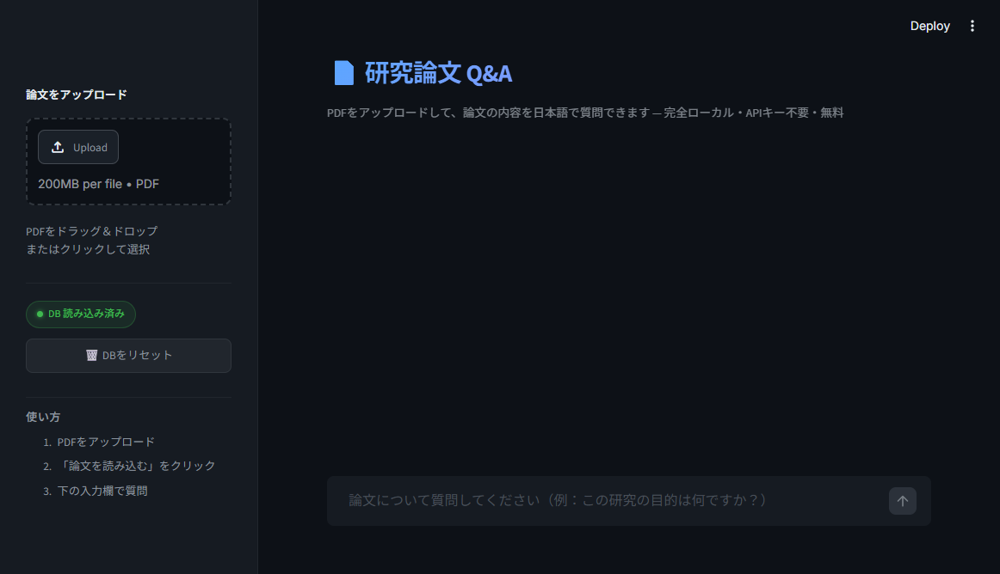

<div align="center">

# 📄 研究論文 Q&A（ローカルRAG）

研究論文のPDFをアップロードして、日本語で質問できる **ローカルRAGチャットアプリ**

**APIキー不要 · 完全無料 · データ外部送信なし**

<p>
  
  
  
  
  
  
</p>



</div>

---

## ✨ 特徴

- **📄 複数PDF対応** — 複数の論文を同時にアップロード・横断検索
- **🇯🇵 日本語完全対応** — 英語論文にも日本語で質問・回答
- **🔒 完全ローカル** — Ollamaを使用、APIキー不要・データ外部送信なし
- **📎 出典表示** — 回答の根拠となった論文箇所（ページ番号付き）を展開表示
- **⚡ 高速検索** — ChromaDBによるベクトル類似検索（上位8件）
- **🎨 ダークUI** — Streamlitにカスタムテーマ + CSSを注入したモダンなインターフェース

---

## 🛠 技術スタック

| 役割 | 技術 | 備考 |
|---|---|---|
| LLM（推論） | [Ollama](https://ollama.com/) + Llama 3.2 | ローカル動作 |
| Embedding | Ollama + nomic-embed-text | ローカル動作 |
| ベクトルDB | ChromaDB | 永続化対応 |
| RAGフレームワーク | LangChain | プロンプト→LLM→出典の構成 |
| UI | Streamlit | カスタムダークテーマ |
| PDF解析 | PyMuPDF | 高速・高精度 |

---

## 🏗 アーキテクチャ

```
PDF アップロード
       │
       ▼
 PyMuPDF でテキスト抽出
       │
       ▼
 RecursiveCharacterTextSplitter
 （800文字 / オーバーラップ100文字 / 句読点「。」対応）
       │
       ▼
 nomic-embed-text でベクトル化
       │
       ▼
 ChromaDB に永続化保存
       │
   ╔═══╧═══╗
   ║  RAG  ║
   ╚═══╤═══╝
       │
       ▼
 質問 → 類似チャンク上位8件を検索
       │
       ▼
 Llama 3.2 で日本語回答生成（参照箇所付き）
```

---

## 🚀 セットアップ

### 1. Ollama のインストール

```bash
# macOS / Linux
curl -fsSL https://ollama.com/install.sh | sh

# Windows
winget install Ollama.Ollama
```

### 2. モデルのダウンロード

```bash
ollama pull llama3.2
ollama pull nomic-embed-text
```

> **Note:** 初回ダウンロードに数分かかります（合計 約2.3GB）

### 3. リポジトリのクローン & 依存ライブラリのインストール

```bash
git clone https://github.com/yowayani517/rag-paper-qa.git
cd rag-paper-qa
pip install -r requirements.txt
```

### 4. アプリの起動

```bash
streamlit run app.py
```

ブラウザで `http://localhost:8501` が自動で開きます。

---

## 📖 使い方

1. **左サイドバー**から研究論文のPDF（複数可）をアップロード
2. **「📥 論文を読み込む」** ボタンをクリック（初回はEmbedding処理に数十秒かかります）
3. **チャット欄**に質問を入力（日本語・英語どちらでも可）
4. 回答と **参照箇所** が表示されます

---

## 🔧 技術的な工夫

| 工夫 | 内容 |
|---|---|
| チャンク設計 | 句読点（`。`）をセパレータに追加し、日本語の文脈を保持 |
| オーバーラップ | 100文字のオーバーラップでチャンク境界の文脈断絶を防止 |
| ハルシネーション抑制 | 「抜粋に答えがない場合は判断できないと答える」よう明示的にプロンプト指示 |
| 完全ローカル動作 | Ollama使用でAPIコスト・プライバシー問題をゼロに |
| UI/UX | Streamlitカスタムテーマ + CSS注入でダークUIを実現 |

---

## 📋 今後の改善点

- [ ] 複数PDFをまたいだ横断検索の精度向上
- [ ] HyDE（仮説文書埋め込み）による検索精度向上
- [ ] ストリーミング出力対応
- [ ] 英語論文→日本語回答の翻訳精度改善
- [ ] Rerankerによる関連度スコアリング改善

---

## 📄 ライセンス

MIT License
